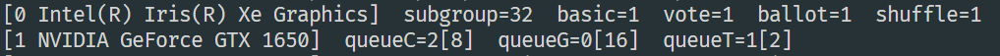

# SD-video-to-HD-video-convertor

## Objective/Aim

To develop a prototype of a video conversion process that can convert SD videos to HD videos using diffusion (image to image, Inpainting) type models, while preserving the context of the video and being efficient.

## Requirements
-  Python 3.x (python>=3.6 (>=3.9 in macOS arm))
-  OpenCV: For video frame extraction and image processing.
-  NumPy: For numerical operations.
-  MoviePy: For compiling image sequences back into video format.
-  Real-ESRGAN: For upscaling image frames.


## Installation
1.To use this package, simply install it via pip:
- pip install realesrgan-ncnn-py moviepy
- pip install numpy
- pip install opencv-python

2.If linux user the you also need to run this:
- apt install -y libomp5 libvulkan-dev


## Path
You need update ```input_video_path``` variable . Change the  ```input_video_path = “path_of_your_video”```
Example in this repo: input_video_path = "input.mp4” 


## GPU
Realesrgan(gpuid=1) :  make sure to change the “gupid”  according to your gpu setup. By default  gpuid = 0 which select default gpu for your  system.
In my case i am using gpuid=1, because I want to use that gpu.

If you don’t; know which one to choose then run “run.py” it will show all gpus of your system with their id’s and you can chose from them. Shown in below figure.




## Usage
1. Prepare the input video:
Place the SD resolution video that you want to upscale in the same directory where run.py file is present  . For example, an ```input.mp4``` file is already present in the this git repo.

2. Run the script:
Ensure you are in the project directory and run the run.py script:

```
 python run.py 
```

3. View the output:
The resulting HD video will be saved in the ```build``` directory as ```output_hd_video.mp4```.

4. Recorded working of the code. 
```
https://drive.google.com/file/d/1EpBf5wz2kqC0Z4CIwtj5rEaaa6Zq_Zqm/view?usp=drive_link
```

